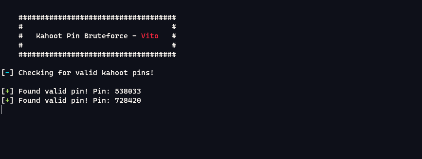

# Kashoot
A simple shitty little tool to bruteforce random kahoot pins!

### Showcase

### requirements
To run kashoot you will need *colorama* and *requests* modules. If you dont have them installed you can install them by doing *pip install -r requirements.txt*

# Cancerous stuff right here
Cya nigs :)
